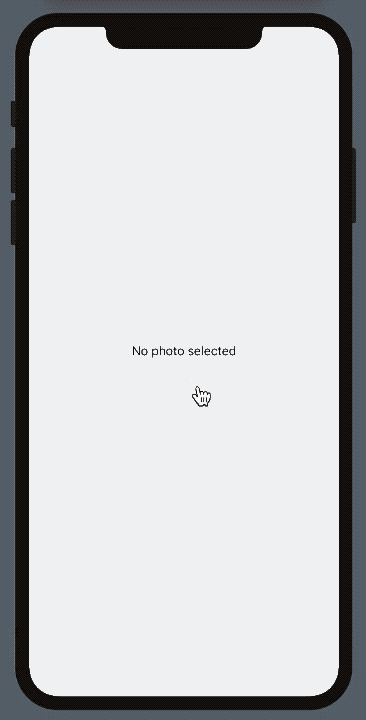

#  ImageFiltersSwiftUI

Проект сделанный в рамках Surf Student IOS workshop 28.10.2020

### Полезные ссылки

#### Дополнительные полезные материалы по SwiftUI

- [🎥 Запись трансляции](https://www.youtube.com/watch?v=jRgQYVWfpUA)
- [SwiftUI Introducing tutorials by Apple](https://developer.apple.com/tutorials/swiftui)
- [SFSymbols overview](https://developer.apple.com/design/human-interface-guidelines/sf-symbols/overview/)
- [Interfacing with UIKit](https://developer.apple.com/tutorials/swiftui/interfacing-with-uikit)
- [Core Image Tutorial: Getting Started](https://www.raywenderlich.com/2305-core-image-tutorial-getting-started)
- [Core Image Filter Reference](https://developer.apple.com/library/archive/documentation/GraphicsImaging/Reference/CoreImageFilterReference/index.html)
- [Еще одна коллекция CIFilter](https://cifilter.io/)
- [SwiftUI by Example](https://www.hackingwithswift.com/quick-start/swiftui)
- [SwiftUI cheat-sheet](https://fuckingswiftui.com/)
- [Swift language basics](https://docs.swift.org/swift-book/LanguageGuide/TheBasics.html)

#### Surf Education

- [Материалы школы iOS разработки](https://surfstudio.github.io/iOSSpringSchool2020/)
- [@surf_edu канал в Telegram](https://t.me/surf_edu) — всё что касается образования и начала карьеры: анонсы, вакансии, стажировки.

